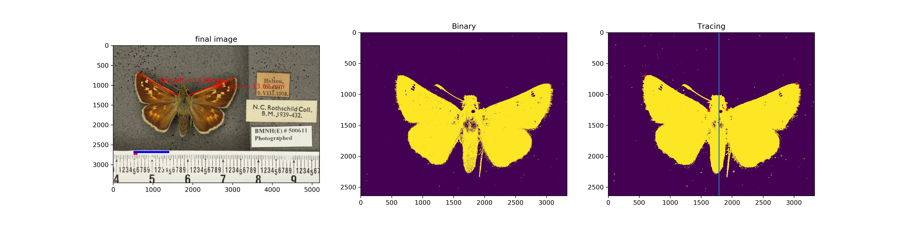
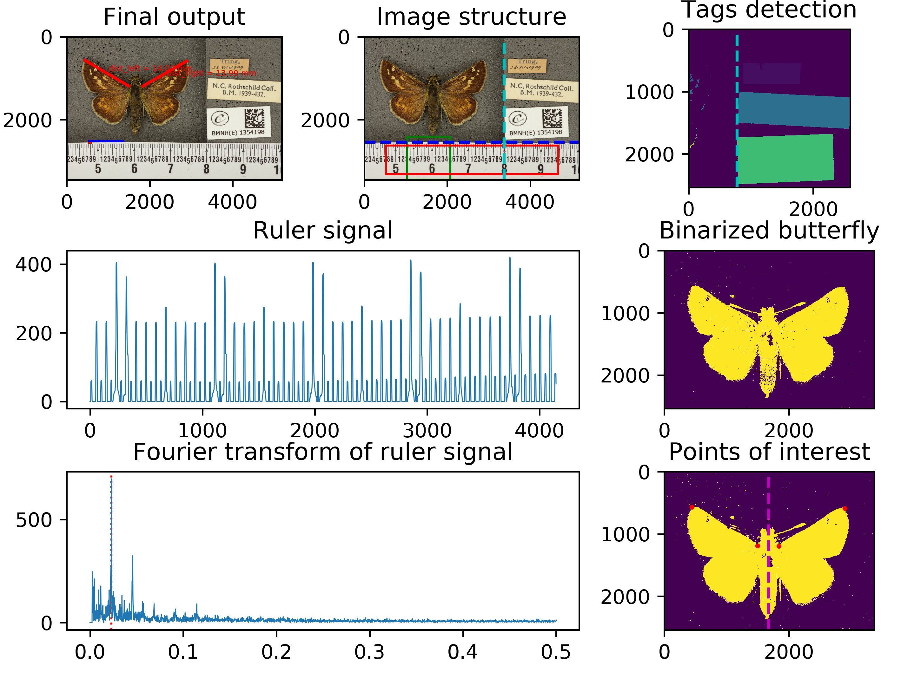

# Butterfly Wings

Analyzing images of butterflies and measuring their wing lengths. Using binarization techniques and calculating the resolution of ruler ticks, we read in images of butterflies and output the millimeter lengths of their wings.



## Usage
```
$ python pipeline.py -p -i [input directory or image path] -o [output directory] -csv [csv output file path]
```
The pipeline script combines four modules to analyze an image: ruler detection, binarization, tracing, and final measurement. These modules are located in `/butterfly`. Python module requirements are listed in `requirements.txt`.

Run the `pipeline.py` file with the arguments to read in raw images and output result images and `.csv` file with the measurements.

The results are cached in `cachedir` so that if the same methods are re-run with the same inputs, the computation will simply be retrieved from memory instead of being recomputed. Delete `cachedir` to remove the cache and to recompute all results. If the source files for any part of the pipeline are tweaked, then results will be recomputed automatically.

## Options
* `-p`, `--plot` : This flag is used to generate output images. When this option is ommited the pipeline do not plot images, thus improving runtime and saving space.
* `-pp`, `--detailed_plot` : Outputs detailed plots to help debugging. Included in the detailed plot are the various points of interest of the image marked in seperate plots, as well as the method we are using to measure the pixels per millimeter on the ruler. This option can also be ommitted to improve runtime and save space. An example of the `-pp` option follows:

<p align="center">
    
</p>

* `-i`, `--input` : A single image input or a directory of images to be analyzed. (Default is `raw_images`).
* `-o`, `--output_folder` : The output directory in which the result images will be outputted. (Default is `outputs`).
* `-s`, `--stage` : The stage which to run the pipeline until. Must be one of  `['ruler_detection', 'binarization', 'measurements']`. Pipeline runs to measurement stage by default (running to completion). Running the pipeline and stopping at an earlier stage can be useful for debugging.
* `-csv`, `--path_csv` :  Path of `.csv` file for the measurement results. (Default is `results.csv`).
* `-dpi` : Optional argument to specify resolution of the output image. (Default is `300`.)
* `-g`, `--grabcut` : Use OpenCV's grabcut method in order to improve binarization on blue butterflies.
* `-u`, `--unet` : Use the U-net deep neural network in the binarization step.

## Example
Example data can be found at [github.com/machine-shop/butterfly-wings-data](https://github.com/machine-shop/butterfly-wings-data). For this example, clone the repository alongside `butterfly-wings`.

A larger repository of test data is now also available at https://zenodo.org/record/3732132.

```
git clone https://github.com/machine-shop/butterfly-wings.git
git clone https://github.com/machine-shop/butterfly-wings-data.git
```
Resulting files:
```
/butterfly-wings
    ...
    pipeline.py
    ...
/butterfly-wings-data
    image1.jpg
    image2.jpg
    ...
```

Running the command
```
$ python pipeline.py -p -u -i ../butterfly-wings-data -o ../test_output -csv ../test_output/results.csv
```
in `/butterfly-wings` will run the pipeline using the U-net deep neural network on the example data in the folder `/butterfly-wings-data`. The file locations should look like this:
```
/butterfly-wings
    ...
    pipeline.py
    ...
/butterfly-wings-data
    image1.jpg
    image2.jpg
    ...
/test_output
    image1.jpg (result image for image1.jpg)
    image2.jpg
    ...
    results.csv
```

## Miscellaneous
The testing suite can be run with `PYTHONPATH=. pytest` from `/butterfly-wings`.

# Result Plotting
`result_plotting.py` is a script that generates a histogram of differences between actual measurements and predicted measurements. This is useful for debugging and evaluating accuracy. This can be used in isolation from the main pipeline, and simply takes in the predicted `results.csv` from the pipeline and either an `.xlsx` file or `.csv` file with actual measurements.

## Usage
```
python result_plotting.py -a "h_comma_wing_lengths.xlsx" -n "full name" -l "Left" -r "Right"
```
Apart from outputting a plot of the differences, it can also output a `comparison.csv` with all differences between predicted and actual measurements, and/or a `outliers.csv` with only measurement differences from outliers. It can also copy outlier images to a `outliers/` folder, for easier debugging by rerunning the pipeline on these outlier images.

## Options
* -a, --actual : File path of either Excel `.xlsx` file or `.csv` file containing the actual measurements.
* -n, --name : Name of column in `actual` file that contains the image names for each measurement.
* -l, --left : Name of column in `actual` file that contains the name of left wing measurements.
* -r, --right : Name of column in `actual` file that contains the name of right wing measurements.
* -p, --predicted : File path of `.csv` predictions outputted by out pipeline. `results.csv` by default.
* -c, --comparison : If specified, will output a `comparison.csv` file containing all measurements and the differences.
* -o, --outliers : If specified, will output a `outliers.csv` file containing only measurements that are deemed outliers.
* -sd, --sd : By default, the SD to determine an outlier is +/- 2 SD's away from the average measurement. If specified, you can use something else.
* -co, --copy_outliers : Specify a folder where the outlier images are from, and copy any outlier images to a `outliers/` folder in the current directory.

## Example
Example files:
```
/"Measured_images_Data_H.comma"
    BMNHE_1354218.JPG
    ...
    ...
/butterfly-wings
    result_plotting.py
    h_comma_wing_lengths.xlsx
    results.csv
```
`h_comma_wing_lengths.xlsx` has these columns:

| full name         | ... | Right | Left   |   |
|-------------------|-----|-------|--------|---|
| BMNHE_1354218.JPG | ... | 15.11 | 15.288 |   |
| ...               | ... | ...   | ...    |   |
|                   |     |       |        |   |

Thus, we will specify `-n "full name"`, `-l "Left"`, `-r "Right"`.

We know what `results.csv` looks like (since it is output by the pipeline).

We also want to output both the `comparison.csv` and `outliers.csv` table, so we will specify `-c` and `-o`, and we also want to copy outliers from the images folder `Measured_images_Data_H.comma`, so we will do `-co "../Measured_images_Data_H.comma"`. We also want to define an outlier as a measurement +-1.75 SD's from the actual measurement, so we well specify `-sd 1.75`. Thus the usage is:

```
python result_plotting.py -a "h_comma_wing_lengths.xlsx" -n "full name" -l "Left" -r "Right" -c -o -co "../Measured_images_Data_H.comma" -sd 1.75 
```

File results:
```
/butterfly-wings
    result_plotting.py
    h_comma_wing_lengths.xlsx
    results.csv
    ...
    result_plot.png
    comparison.csv
    outliers.csv
    /outliers
        BMNHE_1354218.JPG (an outlier image)
        ...
```
